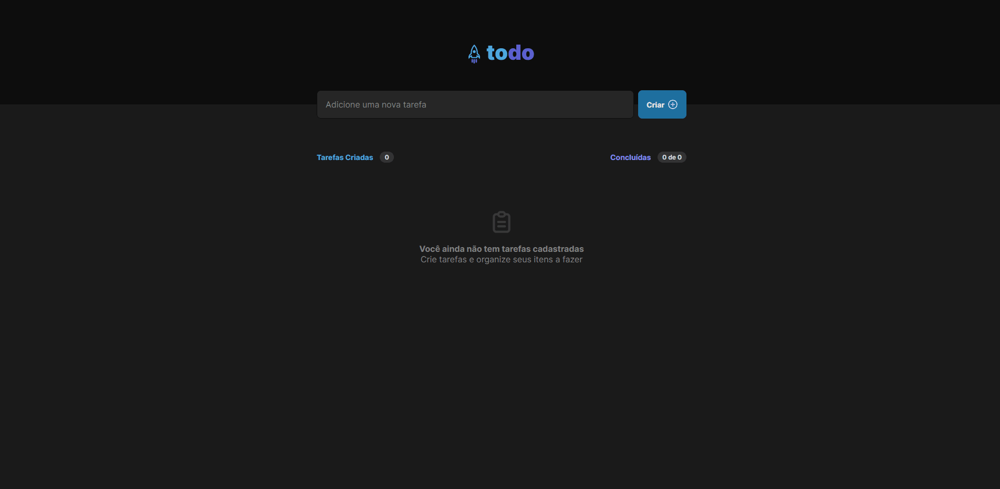

<h1 align="center">
  <span>Todo-list</span>
</h1>

<p align="center">
  <a href="#-projeto">Projeto</a>&nbsp;&nbsp;&nbsp;|&nbsp;&nbsp;&nbsp;
  <a href="#-layout">Layout</a>&nbsp;&nbsp;&nbsp;|&nbsp;&nbsp;&nbsp;
  <a href="#-tecnologias">Tecnologias</a>&nbsp;&nbsp;&nbsp;|&nbsp;&nbsp;&nbsp;
  <a href="#-instalação">Instalação</a>&nbsp;&nbsp;&nbsp;|&nbsp;&nbsp;&nbsp;
  <a href="#memo-licença">Licença</a>
</p>

<br>

<p align="center">
  
</p>

<br>

## 💻 Projeto

Neste desafio foi desenvolvida uma aplicação de controle de tarefas no estilo **to-do list**, que contém as seguintes funcionalidades:

- Adicionar uma nova tarefa
- Marcar e desmarcar uma tarefa como concluída
- Remover uma tarefa da listagem
- Mostrar o progresso de conclusão das tarefas

## 📟 Layout

O layout das telas da aplicação foi desenvolvido pela equipe da Rocketseat através do Figma. O layout pode ser acessado através deste link:
[**Todo-list**](https://www.figma.com/file/lJtMzltv5cdMLOmcfWpjKZ/ToDo-List-(Copy)?node-id=0%3A1&t=vntvc50zgyT0qyo8-0).

## 🚀 Tecnologias

Esse projeto foi desenvolvido com as seguintes tecnologias:

- [Vite](https://vitejs.dev/)
- [Typescript](https://www.typescriptlang.org/)
- [CSS Modules](https://create-react-app.dev/docs/adding-a-css-modules-stylesheet/)
- [Local Storage](https://developer.mozilla.org/pt-BR/docs/Web/API/Window/localStorage)

## 📥 Instalação

Faça um clone desse repositório e acesse o diretório. Em instale todas as dependências com o seguinte comando:

```bash
npm i
```

Em seguida execute o comando
```bash
npm run dev
```


## :memo: Licença

Esse projeto está sob a licença MIT. Veja o arquivo [LICENSE](LICENSE.md) para mais detalhes.

---
**Desenvolvido por [Bruno César](https://github.com/brunocs90).**
